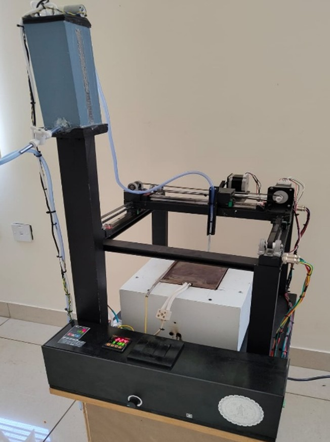
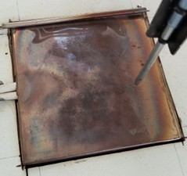
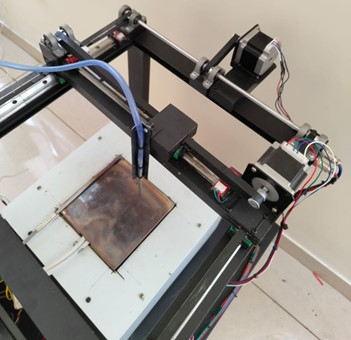
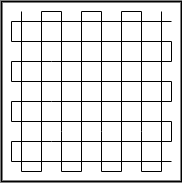
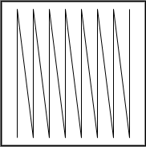
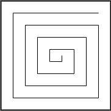
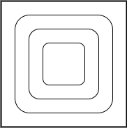
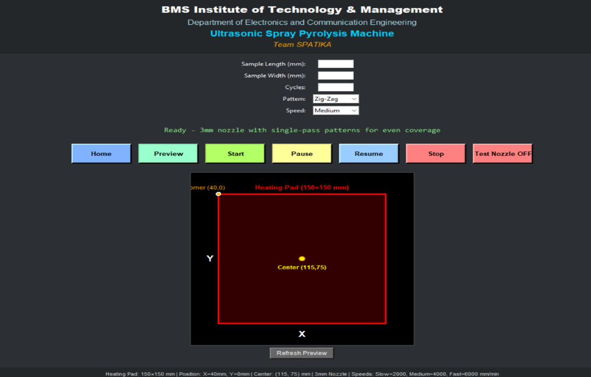

# 🔬 Low-Cost Ultrasonic Spray Pyrolysis System for Thin Film Deposition

> A GRBL-controlled two-axis CNC ultrasonic spray pyrolysis unit for uniform thin-film deposition — developed as an affordable alternative to commercial systems used in materials science, semiconductor, photovoltaic, and thin-film research.


---

# 🌟 Overview

Ultrasonic Spray Pyrolysis (USP) is a widely used thin-film deposition technique for fabricating metal oxides, semiconductors, photovoltaic absorbers, catalytic coatings, and functional materials.

This project presents a **low-cost automated Ultrasonic Spray Pyrolysis System** built using CNC motion control and ultrasonic atomization technology. The system enables research-grade thin-film deposition while remaining significantly more affordable and customizable than commercial alternatives.

The developed system is currently utilized in the **Thin Film Oxide Deposition (TFOD) Laboratory**, Department of Electronics & Communication Engineering, **BMS Institute of Technology & Management (BMSIT&M), Bengaluru**.

---

# 🔬 What is Ultrasonic Spray Pyrolysis?

Ultrasonic Spray Pyrolysis is a thin-film deposition technique where a precursor solution is atomized into micron-sized droplets and delivered onto a heated substrate.

The droplets undergo:

```text
Atomization
      ↓
Aerosol Transport
      ↓
Substrate Heating
      ↓
Solvent Evaporation
      ↓
Thermal Decomposition
      ↓
Thin Film Formation
```

---

## Why Ultrasonic Instead of Conventional Spray?

Traditional pressure-based sprayers suffer from:

❌ Large droplet formation

❌ Splashing effects

❌ Coffee-ring effect

❌ Frequent nozzle clogging

❌ Poor film uniformity

Ultrasonic atomization solves these challenges by generating:

✅ Uniform micron-sized droplets

✅ Low momentum aerosol delivery

✅ No nozzle clogging

✅ Improved coating uniformity

✅ Higher deposition repeatability

---

# 🎯 Problem Statement

Commercial automated spray pyrolysis systems are often prohibitively expensive for academic laboratories and research institutions.

Common limitations include:

* High procurement cost
* Proprietary software
* Limited customization
* Maintenance-intensive nozzle systems
* Restricted experimental flexibility

This project addresses these issues through an open, modular, and low-cost ultrasonic deposition platform suitable for academic and research applications.

---

## 📸 Complete System

<p align="center">
  
</p>

<p align="center">
<i>Complete assembled ultrasonic spray pyrolysis system including CNC motion platform, ultrasonic atomizer, heated substrate stage, and control electronics.</i>
</p>

---

# 🏗️ System Design

## Core Operating Principle

```text
[Precursor Solution]
        ↓
[Ultrasonic Atomizer (1–2 MHz)]
        ↓
[Micron-Sized Aerosol Droplets]
        ↓
[CNC-Controlled Raster Scanning]
        ↓
[Heated Substrate]
        ↓
[Solvent Evaporation]
        ↓
[Thermal Decomposition]
        ↓
[Thin Film Formation]
```

---

## 📊 System Block Diagram

<p align="center">
  
</p>

<p align="center">
<i>System block diagram illustrating ultrasonic atomization, aerosol transport, CNC motion control, and thin-film deposition.</i>
</p>

---

## 🔄 Process Flow Diagram

<p align="center">
  
</p>

<p align="center">
<i>Process flow of the ultrasonic spray pyrolysis deposition mechanism.</i>
</p>

---

# ⚙️ Two-Axis CNC Motion Platform

### Motion Control System

* Controller: Arduino Uno + GRBL Firmware
* Motion Axes: X-Axis & Y-Axis
* Motors: NEMA Stepper Motors
* Programming: G-Code
* Scanning Method: Raster Motion

### Features

* Adjustable scan speed
* Adjustable overlap percentage
* Configurable deposition area
* High repeatability
* Open-source architecture

### Purpose

The CNC motion platform ensures uniform precursor distribution across the substrate surface, resulting in improved film thickness uniformity and reproducibility.

---

## 📸 Deposition Area

<p align="center">
  
</p>

<p align="center">
<i>Ultrasonic atomization and heated deposition region used for controlled thin-film formation.</i>
</p>

---

## 📸 Nozzle Motion System

<p align="center">
  
</p>

<p align="center">
<i>CNC-controlled nozzle movement used for precise raster scanning and uniform precursor deposition.</i>
</p>

---

## 📸 Motion Patterns

<table align="center">
<tr>
<td align="center">

<br>
<b>Grid Pattern</b>
</td>

<td align="center">

<br>
<b>Zigzag Pattern</b>
</td>
</tr>

<tr>
<td align="center">

<br>
<b>Spiral Pattern</b>
</td>

<td align="center">

<br>
<b>Loop Pattern</b>
</td>
</tr>
</table>

---

# 🔧 Hardware Components

| Component                     | Purpose                         |
| ----------------------------- | ------------------------------- |
| Ultrasonic Atomizer (1–2 MHz) | Generates fine aerosol droplets |
| Arduino Uno + GRBL Shield     | CNC motion control              |
| NEMA Stepper Motors           | X-Y movement                    |
| Heated Substrate Stage        | Thin-film formation             |
| Temperature Controller        | Controls substrate temperature  |
| Aerosol Guide Channel         | Directs aerosol to substrate    |
| Peristaltic / Syringe Pump    | Controlled precursor feed       |
| Mechanical Frame              | Structural support              |

---

# 📈 Process Parameters

| Parameter              | Effect on Film        | Control Method       |
| ---------------------- | --------------------- | -------------------- |
| Ultrasonic Frequency   | Droplet size          | Transducer selection |
| Substrate Temperature  | Thermal decomposition | Heater control       |
| Scan Speed             | Deposition rate       | G-Code feed rate     |
| Raster Overlap         | Film uniformity       | Scan spacing         |
| Solution Concentration | Film thickness        | Precursor molarity   |
| Number of Passes       | Final thickness       | Program repetition   |

---

# ✅ Experimental Results

### Achievements

* ✅ Uniform thin-film deposition validated
* ✅ Repeatable deposition performance
* ✅ Elimination of coffee-ring effect
* ✅ No nozzle clogging during extended operation
* ✅ Successful deposition across multiple substrates
* ✅ Modular and scalable design

---

## 📸 Monitoring Interface

<p align="center">
  
</p>

<p align="center">
<i>System monitoring and motion-control interface used for configuring deposition parameters and observing system operation.</i>
</p>

---

# 💡 Advantages Over Commercial Systems

| Feature              | Commercial USP Systems | This Project       |
| -------------------- | ---------------------- | ------------------ |
| Cost                 | Very High              | Low Cost           |
| Control Software     | Proprietary            | Open Source        |
| Customization        | Limited                | Fully Customizable |
| Nozzle Clogging      | Possible               | Eliminated         |
| Maintenance Cost     | High                   | Low                |
| Research Flexibility | Limited                | High               |
| Footprint            | Large                  | Compact            |

---

# 🔮 Applications

The system is suitable for deposition of:

* ZnO Thin Films
* TiO₂ Thin Films
* SnO₂ Thin Films
* Fe₂O₃ Thin Films
* CZTS Solar Absorber Layers
* ZnS Buffer Layers
* Transparent Conductive Oxides (TCO)
* Gas Sensor Materials
* Catalytic Coatings
* Electronic Device Dielectrics

---

# 🏆 Impact

* 🔬 Supports thin-film research at BMSIT&M
* 🎓 Provides affordable deposition infrastructure for academic laboratories
* ⚙️ Fully customizable for future materials research
* 🌱 Enables low-cost semiconductor and photovoltaic research
* 🧪 Supports experimental validation of novel thin-film materials

---

# 👥 Team — Spatika

| Name              | Affiliation  |
| ----------------- | ------------ |
| Sri Srujan Hari T | ECE, BMSIT&M |
| Tarun Patil       | ECE, BMSIT&M |
| Nitish K S        | ECE, BMSIT&M |
| Harshitha K V     | ECE, BMSIT&M |

---

# 🏫 Laboratory Utilization

The developed Ultrasonic Spray Pyrolysis System is currently utilized in the **Thin Film Oxide Deposition (TFOD) Laboratory**, Department of Electronics & Communication Engineering, **BMS Institute of Technology & Management (BMSIT&M), Bengaluru**, for thin-film deposition experiments, materials characterization studies, and academic research activities.

---

# 📬 Contact

For technical discussions, thin-film deposition research, system replication, or collaboration enquiries:

📧 **[tarunpatil018@gmail.com](mailto:tarunpatil018@gmail.com)**

🏫 **Department of Electronics & Communication Engineering**
BMS Institute of Technology & Management (BMSIT&M)
Yelahanka, Bengaluru – 560119
Karnataka, India 🇮🇳

---

<p align="center">
⭐ Developed at BMS Institute of Technology & Management (BMSIT&M) ⭐
</p>

<p align="center">
🔬 Supporting Thin Film Oxide Deposition Research at BMSIT&M 🔬
</p>
